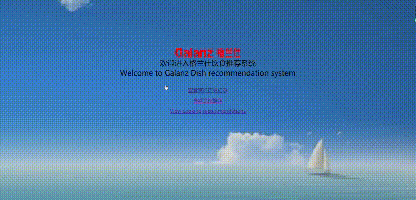
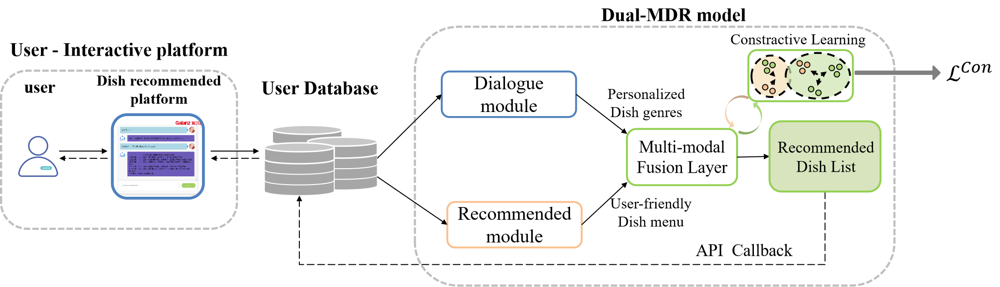

# Dual-MDR: Dual-stream microwave dish recommendation system based on Multimodal Dialogue-Recommendation and comparative learning
This repository contains the PyTorch and Flask implementation of the paper: 

***Dual-MDR: Dual-stream microwave dish recommendation system based on Multimodal Dialogue-Recommendation and comparative learning***. 

**Author:** [Qingpeng Wen](mailto:wqp@mail2.gdut.edu.cn), Prof. [Bi Zeng](mailto:zb9215@gdut.edu.cn), Mentor [Pengfei Wei](mailto:wpf@gdut.edu.cn), 

## Deployment Display

- **Display for Chinese:**

  <iframe src="show_zh.mp4">

- **Display for English:**

  

## Architecture

## Requirements

Our code is based on Python 3.7.6 and PyTorch 1.1. Requirements are listed as follows:
> - torch==1.1.0
> - transformers==2.4.1
> - numpy==1.18.1
> - tqdm==4.42.1
> - seqeval==0.0.12

We highly suggest you using [Anaconda](https://www.anaconda.com) to manage your python environment.

## Acknowledgement
This work is jointly completed by ***ESAC Lab*** from Guangdong University of Technology and Guangdong Galanz Group Co., LTD., in part by the Key technology project of Shunde District under Grant 2130218003002, Thanks for the support provided by Guangdong Galanz Group Co., LTD.
